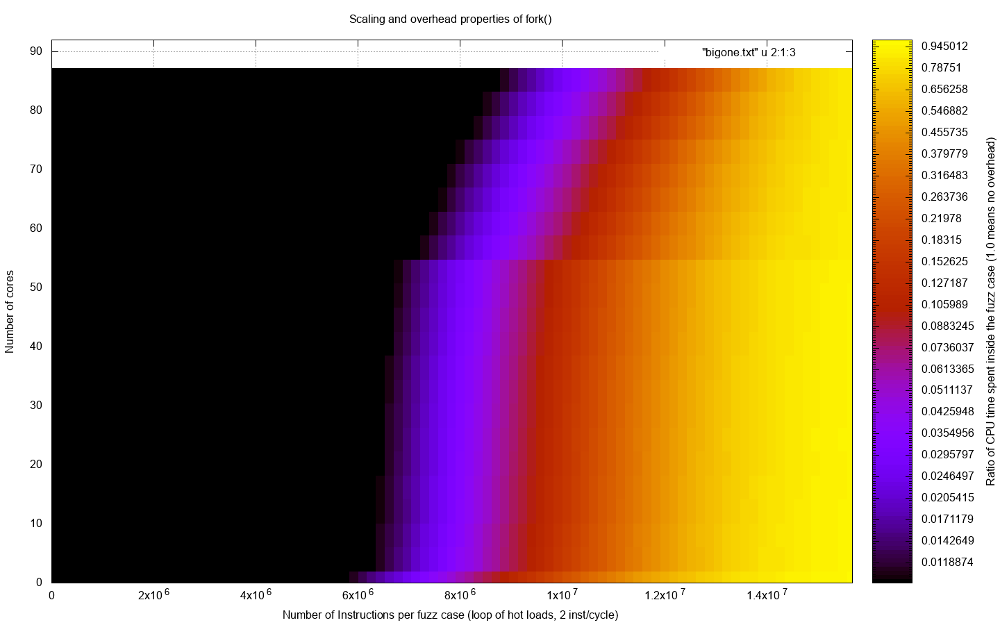

# About

This is a small test program which can test the best-case performance of `fork()` based resets, similar to what AFL uses. Unlike forkserver, this does not do any IPC (read/write to a pipe to synchronize and task the workers), thus this is a best case scenario. Further, the test cases do not modify any memory thus the CoW costs of the fork() are 0.

TL;DR: This is an absolute best-case scenario for fork()-based VM resetting, with no CoW required since no memory is dirtied

# Data

